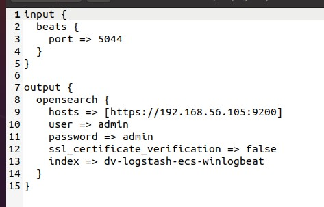

# ESXi 6.7 on NUC8i7BEH (with Ubuntu 20.04 in VMware Workstation Pro 16)

- [ESXi 6.7 on NUC8i7BEH (with Ubuntu 20.04 in VMware Workstation Pro 16)](#esxi-67-on-nuc8i7beh-with-ubuntu-2004-in-vmware-workstation-pro-16)
   - [Prerequisites](#prerequisites)
      - [Ubuntu Environment Configurations](#ubuntu-environment-configurations)
      - [ESXi Environment Configurations](#esxi-environment-configurations)
   - [Build and Deploy](#build-and-deploy)
      - [Clone TestLab Repo](#clone-testlab-repo)
      - [Packer Build](#packer-build)
      - [Terraform Build](#terraform-build)
      - [Ansible Playbook](#ansible-playbook)
      - [Deploy Wazuh (automatically)](#deploy-wazuh-automatically)
      - [Deploy Wazuh (manually)](#deploy-wazuh-manually)
      - [Deploy opensearch and winlogbeat (automatically)](#deploy-opensearch-and-winlogbeat-automatically)
      - [Deploy opensearch and winlogbeat (manually)](#deploy-opensearch-and-winlogbeat-manually)
   - [Things to Notice](#things-to-notice)
      - [Prerequisites](#prerequisites-1)
      - [Build and Deploy](#build-and-deploy-1)

Although this setup uses Ubuntu 20.04 guest OS in VMware, the same should apply to native OS running bare metal.

## Prerequisites

### Ubuntu Environment Configurations

Note that all the commands in this subsection should be executed on the **Ubuntu** machine.

1. Before starting building the lab, updating the system is recommended. This can be done by executing `sudo apt update` and then `sudo apt full-upgrade --yes`. Finally, `reboot` the machine.

2. Install necessary tools by executing the following command.

   ```shell
   sudo apt install build-essential curl git python3-pip gnupg software-properties-common
   ```

   After that, you may want to add `~/.local/bin` to the `PATH` variable to access tools installed by `pip3` by the following command.

   ```shell
   echo 'export PATH="$PATH:~/.local/bin"' >> ~/.bashrc
   ```

3. Install *Terraform* by executing the following commands. Find more on [the official website](https://www.terraform.io/downloads).

   ```shell
   curl -fsSL https://apt.releases.hashicorp.com/gpg | sudo apt-key add -
   sudo apt-add-repository "deb [arch=amd64] https://apt.releases.hashicorp.com $(lsb_release -cs) main"
   sudo apt-get update && sudo apt-get install terraform
   ```

4. Install *Vagrant* by executing the following commands. Find more on [the official website](https://www.vagrantup.com/downloads).

   ```shell
   curl -fsSL https://apt.releases.hashicorp.com/gpg | sudo apt-key add -
   sudo apt-add-repository "deb [arch=amd64] https://apt.releases.hashicorp.com $(lsb_release -cs) main"
   sudo apt-get update && sudo apt-get install vagrant
   ```

5. Install *Packer* by executing the following commands. Find more on [the official website](https://www.packer.io/downloads).

   ```shell
   curl -fsSL https://apt.releases.hashicorp.com/gpg | sudo apt-key add -
   sudo apt-add-repository "deb [arch=amd64] https://apt.releases.hashicorp.com $(lsb_release -cs) main"
   sudo apt-get update && sudo apt-get install packer
   ```

6. Install *Ansible* by the following command. Find more on [the official documentation](https://docs.ansible.com/ansible/latest/installation_guide/intro_installation.html).

   ```shell
   pip3 install ansible
   ```

   Alternatively:

   ```shell
   sudo apt update
   sudo apt install software-properties-common
   sudo add-apt-repository --yes --update ppa:ansible/ansible
   sudo apt update
   sudo apt install ansible
   ```

7. Install `pywinrm` by the following command.

   ```shell
   pip3 install pywinrm
   ```

8. Install `sshpass` to allow *Ansible* to use password login by the following command.

   ```shell
   sudo apt install sshpass
   ```

9. To avoid a bug with *Ansible*, set an environment variable by the following command. Find more info [here](https://github.com/clong/DetectionLab/issues/543).

   ```shell
   echo 'export OBJC_DISABLE_INITIALIZE_FORK_SAFETY=YES' >> ~/.bashrc
   ```

10. Install `ovftool`. Open a web browser and download [ovftool](https://developer.vmware.com/web/tool/4.4.0/ovf). Unzip the downloaded file and add its path to your `PATH` environment variable by the following commands. Find more on [the official website](https://docs.vmware.com/en/VMware-Telco-Cloud-Operations/1.4.0/deployment-guide-140/GUID-95301A42-F6F6-4BA9-B3A0-A86A268754B6.html).

    ```shell
    unzip <YOUR DOWNLOADED FILE>
    echo 'export PATH="$PATH:<PATH TO YOUR UNZIPPED FOLDER>"' >> ~/.bashrc
    ```

11. Reload shell environment by `source ~/.bashrc`.

### ESXi Environment Configurations

Note that all the commands in this subsection should be executed on the **ESXi** machine. Find more in the Software section of [this tutorial](https://clo.ng/blog/detectionlab-on-esxi/) and the instructions [here](https://nickcharlton.net/posts/using-packer-esxi-6.html).

1. Navigate to `https://<YOUR ESXi IP ADDRESS>/ui/#/host/manage/services` and set the policy for SSH to *start and stop with host*, and be sure to manually start the service as well.

2. The ESXi instance must have at least two separate networks - a network accessible from your current machine with internet connectivity and a hostonly network to allow the VMs to communicate over a private network. The network that provides DHCP and internet connectivity must also be reachable from the host that is running *Terraform* - ensure your firewall is configured to allow this. Below are some references.

   

   

3. Allow *Packer* to infer the guest IP from ESXi without the VM needing to report it itself by the following command.

   ```shell
   esxcli system settings advanced set -o /Net/GuestIPHack -i 1
   ```

4. Open VNC ports on the firewall. Either configure it **temporarily** following the instructions [here](https://nickcharlton.net/posts/using-packer-esxi-6.html) or **permanently** [here](https://github.com/sukster/ESXi-Packer-VNC). Find more in [official article 1](https://kb.vmware.com/s/article/2008226) and [official article 2](https://kb.vmware.com/s/article/2043564).

   **Permanently**:

   1. Ensure that the Acceptance Level in ESXi is set to "Community" by going to Manage -> Security & Users -> Acceptance Level or the following command.

      ```shell
      esxcli software acceptance set --level=CommunitySupported
      ```

   2. Upload the VIB file to `/vmfs/volumes/datastore1/tmp` directory of the ESXi server

   3. Login to ESXi via SSH and execute the following command.

      ```shell
      esxcli software vib install -v /vmfs/volumes/datastore1/tmp/packer-vnc.vib -f
      ```

   4. Verify using the following commands.

      ```shell
      esxcli software vib list | grep 'vnc'
      esxcli network firewall ruleset list | grep 'vnc'
      ```

## Build and Deploy

After all the prerequisites are satisfied, do the following. Note that all the commands in this subsection should be executed on the **Ubuntu** machine.

### Clone TestLab Repo

Clone the repository to your workspace by `git clone git@github.com:eWalker-TestLab/TestLab.git`. Make sure you have access right to the repository.

### Packer Build

1. Change your working directory to `TestLab/ESXi/Packer`.

2. Edit `TestLab/ESXi/Packer/variables.json` to match your ESXi configuration. The `esxi_network_with_dhcp_and_internet` variable refers to any ESXi network that will be able to provide DHCP and internet access to the VM while it’s being built in *Packer*. This is usually *VM Network*. The file should be similar to the following. Find more info [here](https://detectionlab.network/deployment/esxi/#steps).

   

3. Since ESXi 6.7 is used, delete the following code snippets from `TestLab/ESXi/Packer/ubuntu2004_esxi.json`, `TestLab/ESXi/Packer/windows_2016_esxi.json`, and `TestLab/ESXi/Packer/windows_10_esxi.json`. Find more info [here](https://detectionlab.network/deployment/esxi/#special-configuration-for-esxi-6x).

   ```json
   "vnc_over_websocket": true,
   "insecure_connection": true,
   ```

4. Execute the following commands from the `TestLab/ESXi/Packer` directory.

   ```shell
   PACKER_CACHE_DIR=../../Packer/packer_cache packer build -var-file variables.json ubuntu2004_esxi.json
   PACKER_CACHE_DIR=../../Packer/packer_cache packer build -var-file variables.json windows_2016_esxi.json
   PACKER_CACHE_DIR=../../Packer/packer_cache packer build -var-file variables.json windows_10_esxi.json
   PACKER_CACHE_DIR=../../Packer/packer_cache packer build -var-file variables.json kali2022_esxi.json
   ```

   **NOTE**: Outputting *Packer* debug information is highly recommended. To do so, use the following commands instead of the above build commands. Find more on [the official website](https://www.packer.io/docs/debugging).

   ```shell
   PACKER_CACHE_DIR=../../Packer/packer_cache PACKER_LOG=1 packer build -var-file variables.json ubuntu2004_esxi.json &> logs/packer_build_ubuntu20.log
   PACKER_CACHE_DIR=../../Packer/packer_cache PACKER_LOG=1 packer build -var-file variables.json windows_2016_esxi.json &> logs/packer_build_winserver2016.log
   PACKER_CACHE_DIR=../../Packer/packer_cache PACKER_LOG=1 packer build -var-file variables.json windows_10_esxi.json &> logs/packer_build_win10.log
   PACKER_CACHE_DIR=../../Packer/packer_cache PACKER_LOG=1 packer build -var-file variables.json kali2022_esxi.json &> logs/packer_build_kali.log
   ```

   To view the log files in real-time, use `tail -f <PATH TO YOUR LOG FILE>`.

5. After *Packer* finishes building, verify that `Windows10`, `WindowsServer2016`, `Ubuntu2004`, and `Kali2022` exist in the ESXi console.

### Terraform Build

1. Change your working directory to `TestLab/ESXi`.

2. Create a `terraform.tfvars` file to override the default variables listed in `variables.tf`. The file should be similar to the following.

   

3. Execute the following commands.

   ```shell
   terraform init
   terraform apply -auto-approve -parallelism=4
   ```

   **NOTE**: Outputting *Terraform* debug information is highly recommended. To do so, use the following commands instead of the above build commands. Find more on [the official website](https://www.terraform.io/internals/debugging).

   ```shell
   TF_LOG=DEBUG terraform init &> logs/terraform_init_0.log
   TF_LOG=DEBUG terraform apply -auto-approve -parallelism=4 &> logs/terraform_apply_0.log
   ```

4. After *Terraform* finishes building, verify that all the guests defined in `TestLab/ESXi/main.tf` exist in the ESXi console.

### Ansible Playbook

1. Change your working directory to `TestLab/ESXi/ansible`.

2. Edit `TestLab/ESXi/ansible/inventory.yml` and replace the IP addresses with the respective IP addresses of the corresponding ESXi VMs. The file should be similar to the following.

   

3. Change MAC addresses in `TestLab/ESXi/ansible/group_vars/testlab.yml` to match the MAC address in `TestLab/ESXi/variables.tf` and `TestLab/ESXi/terraform.tfvars` if you changed them earlier.

4. Take snapshots of all of the VMs. Better to unlock all the VMs to prevent connection problems. Then run the following command.

   ```shell
   ansible-playbook -v detectionlab.yml
   ```

   **NOTE**: Outputting *Ansible* debug information is highly recommended. To do so, use the following commands instead of the above build commands. Find more by `ansible --help` command.

   ```shell
   ansible-playbook -vvvv detectionlab.yml --tags "logger" &> logs/ansible-playbook_logger.log
   ansible-playbook -vvvv detectionlab.yml --tags "dc" &> logs/ansible-playbook_dc.log
   ansible-playbook -vvvv detectionlab.yml --tags "wef" &> logs/ansible-playbook_wef.log
   ansible-playbook -vvvv detectionlab.yml --tags "win10" &> logs/ansible-playbook_win10.log
   ansible-playbook -vvvv detectionlab.yml --tags "container" &> logs/ansible-playbook_container.log
   ansible-playbook -vvvv detectionlab.yml --tags "kali" &> logs/ansible-playbook_kali.log
   ```

5. After *Ansible* finishes building, the result should be similar to the following.

   ```log
   192.168.1.227              : ok=39   changed=24   unreachable=0    failed=0    skipped=0    rescued=0    ignored=0
   192.168.1.46               : ok=40   changed=20   unreachable=0    failed=0    skipped=2    rescued=0    ignored=0
   192.168.1.60               : ok=25   changed=16   unreachable=0    failed=0    skipped=0    rescued=0    ignored=0
   192.168.1.17               : ok=29   changed=21   unreachable=0    failed=0    skipped=0    rescued=0    ignored=0
   ```

### Deploy Wazuh (automatically)

After finishing building the **logger** with *Ansible*, Wazuh Server should be installed on the **logger** already. The credential is `admin:TestLab123?`.

### Deploy Wazuh (manually)

1. It is highly recommended to take snapshots of all VMs before installing Wazuh. Then, power off the **logger** VM and change its RAM to **at least 8GB**.

2. In the **logger** VM, add `User=root` to the `/usr/lib/systemd/system/fwupd-refresh.service` file. The file should be similar to the following. Find more info [here](https://github.com/fwupd/fwupd/issues/3037).

   

3. In the **logger** VM, execute the following command. Find more on [the official website](https://documentation.wazuh.com/current/quickstart.html#installing-wazuh).

   ```shell
   curl -sO https://packages.wazuh.com/4.3/wazuh-install.sh && sudo bash ./wazuh-install.sh -a
   ```

4. In the **dc**, **wef**, and **win10** VM, download the installer from [the official website](https://packages.wazuh.com/4.x/windows/wazuh-agent-4.3.5-1.msi). Then double click the downloaded file to install it. Find more on [the official website](https://documentation.wazuh.com/current/installation-guide/wazuh-agent/wazuh-agent-package-windows.html).

### Deploy opensearch and winlogbeat (automatically)

1. Move directory to `~/tool/`

2. Run the following commands on three teminals respectively to start opensearch service:

   ```shell
   ./opensearch/opensearch-tar-install.sh
   ./dashboard/bin/opensearch-dashboards
   ./logstash/bin/logstash -f ./logstash/testconf
   ```

3. Go to `<this.host.ip.address>:5601` with `admin:admin` to work on opensearch

4. further filter.conf files can add to `~/tool/logstash/testconf/`

### Deploy opensearch and winlogbeat (manually)

1. In agent VMs, download and unzip winlogbeat-oss from [website](https://www.elastic.co/downloads/beats/winlogbeat-oss).  Find more from [official document](https://www.elastic.co/guide/en/beats/winlogbeat/current/winlogbeat-installation-configuration.html).

2. Change current directory to winlogbeat folder. Open a PowerShell prompt as an Administrator. Run

   ```powershell
   .\install-service-winlogbeat.ps1
   ```

3. Configure `winlogbeat.yml` file as follows.

   - Use `Get-EventLog *` on PowerShell to get the list of available event logs. And put all entrices under `winlogbeat.event_logs:`. Find more info [here](https://www.elastic.co/guide/en/beats/winlogbeat/current/configuration-winlogbeat-options.html#configuration-winlogbeat-options-event_logs-name)

      

      

   - Configure winlogbeat to output all logs to logstash on **logger**

      

4. Run

   ```powershell
   .\winlogbeat.exe setup -e
   Start-Service winlogbeat
   ```

5. Move to **logger** vm. Download and unzip opensearch, opensearch dashboard, and logstash from [website](https://opensearch.org/downloads.html)

6. Refer to [here](http://192.168.68.198:7111/wiki/Falcon/Opensearch)

   

   Run command once to install necessary files:

   ```powershell
   ./opensearch/opensearch-tar-install.sh
   ```

7. Configure both opensearch and dashboard yml file under respective config folder similar to follow:

   

8. Create a `testconf` folder to store all the filter and conf files. Create a `test.conf` file inside the folder.

9. Edit the config file similar to the following to receive event logs from winlogbeat.

   

10. Run following commands on three teminal respectively to start the service:

    ```powershell
    ./opensearch/opensearch-tar-install.sh
    ./dashboard/bin/opensearch-dashboards
    ./logstash/bin/logstash -f ./logstash/testconf
    ```

11. Now you can go to `<this.host.ip.address>:5601` with `admin:admin` to work on opensearch.

## Things to Notice

### Prerequisites

- It is recommended to install setup the environment using *Linux* or *macOS*. *Windows* is not recommended because some of the tools, such as *Ansible*, cannot run on *Windows* according to [the official documentation](https://docs.ansible.com/ansible/latest/user_guide/windows_faq.html#can-ansible-run-on-windows).

- It is recommended to check your system's proxy settings. Also, it is recommended not to use any proxy applications or browser plugins (e.g., *SwitchyOmega*) during the setup process.

### Build and Deploy

- When cloning the `TestLab` repo, **DO NOT** clone the repo to the local machine and then copy and paste the repo into your working virtual machine. This will cause some permission errors. Find more on [the official website](https://docs.ansible.com/ansible/latest/reference_appendices/config.html#avoiding-security-risks-with-ansible-cfg-in-the-current-directory).

- To rebuild a specific VM, run the following from `TestLab/ESXi`.

  ```shell
  terraform apply -replace="esxi_guest.<dc/logger/wef/win10>"
  ```

  Then go to `TestLab/ESXi/ansible` and run

  ```shell
  ansible-playbook -v detectionlab.yml --tags "<dc/logger/wef/win10>"
  ```

- To restart the playbook at a specific task, use

  ```shell
  ansible-playbook -v detectionlab.yml --tags="<dc/logger/wef/win10>" --start-at-task="<taskname>"
  ```


## TODO 

- filebeat
   - install filebeat on container / docker
   - modify logstash config to receive log from filebeat

- windows domain name 
   - make domain name variable (current: windows.domain / prosteritas.local) 

- winlogbeat config
   - set logger ipaddress variable on winlogbeat config file with "sed" command 

- wazuh
   - make wazuh sever send alert log to wazuh server 
   - check wazuh dashboard logging
   - make wazuh agent send event log to logstash
   - check wazuh / opensearch dashboard for the log outcome

### the following come from Q&A session 
- how to upgrade OS system with make \
   e.g. win10 -> win11 \
   e.g. hotfix/security patch 

- can we copy file(upload script) in packer 

- what happen if packer script have wrong variable

- can preseed.cfg (hardcode password) be variable \
   or run a script to build preseed.cfg \
   (the existing script ping for preseed.cfg on detectionlab)

- is it possible build template with 'thin provision' \
  (boot_disk_type = thick)

- is mac address neccessay

- does opensearch apt package
   - may not in ubuntu 2004

- how to keep data even with terraform destroy 

- use hostname instead of ip address 
   - dc with DNS service

- ansible inventory implement group