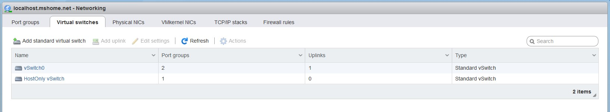

# ESXi 6.7 on NUC8i7BEH (with Ubuntu 20.04 in VMware Workstation Pro 16)

## Build Procedure

Although this setup is done using Ubuntu 20.04 guest OS in VMware, the same should apply to native OS running bare metal.

### Prerequisites

#### Ubuntu Environment Configurations

1. Before starting building the lab, updating the system is recommended. This can be done by executing `sudo apt update` and then `sudo apt full-upgrade -y`. Finally, `reboot` the machine.

2. Install necessary tools by executing the following command:

   ```bash
   sudo apt install build-essential curl git gnupg software-properties-common
   ```

3. Install *Terraform* by executing the following commands (more info on [the official website](https://www.terraform.io/downloads)):

   ```bash
   curl -fsSL https://apt.releases.hashicorp.com/gpg | sudo apt-key add -
   sudo apt-add-repository "deb [arch=amd64] https://apt.releases.hashicorp.com $(lsb_release -cs) main"
   sudo apt-get update && sudo apt-get install terraform
   ```

4. Install *Vagrant* by executing the following commands (more info on [the official website](https://www.vagrantup.com/downloads)):

   ```bash
   curl -fsSL https://apt.releases.hashicorp.com/gpg | sudo apt-key add -
   sudo apt-add-repository "deb [arch=amd64] https://apt.releases.hashicorp.com $(lsb_release -cs) main"
   sudo apt-get update && sudo apt-get install vagrant
   ```

5. Install *Packer* by executing the following commands (more info on [the official website](https://www.packer.io/downloads)):

   ```bash
   curl -fsSL https://apt.releases.hashicorp.com/gpg | sudo apt-key add -
   sudo apt-add-repository "deb [arch=amd64] https://apt.releases.hashicorp.com $(lsb_release -cs) main"
   sudo apt-get update && sudo apt-get install packer
   ```

6. Install *Ansible* using the following commands. More details can be found in the [official documentation](https://docs.ansible.com/ansible/latest/installation_guide/intro_installation.html).

   ```bash
   sudo apt update
   sudo apt install software-properties-common
   sudo add-apt-repository --yes --update ppa:ansible/ansible
   sudo apt update
   sudo apt install ansible
   ```

7. Install `pywinrm` using the following command.

   ```bash
   pip3 install pywinrm
   ```

8. Install `sshpass` to allow *Ansible* to use password login by the following command:

   ```bash
   sudo apt install sshpass
   ```

9. To avoid a bug with *Ansible*, set an environment variable using the following command.

   ```bash
   echo 'export OBJC_DISABLE_INITIALIZE_FORK_SAFETY=YES' >> ~/.bash_profile
   ```

10. Install `ovftool`. In Ubuntu, open a web browser and download [ovftool](https://developer.vmware.com/web/tool/4.4.0/ovf). Unzip the downloaded file and add its path to your `PATH` environment variable by the following commands. Refer [here](https://docs.vmware.com/en/VMware-Telco-Cloud-Operations/1.4.0/deployment-guide-140/GUID-95301A42-F6F6-4BA9-B3A0-A86A268754B6.html).

    ```bash
    unzip <YOUR DOWNLOADED FILE>
    echo 'export PATH="$PATH:<PATH TO YOUR UNZIPPED FOLDER>"' >> ~/.bash_profile
    ```

#### ESXi Environment Configurations

Refer to the instructions [here](https://clo.ng/blog/detectionlab-on-esxi/) in the Software section and also [here](https://nickcharlton.net/posts/using-packer-esxi-6.html). The following steps should be executed on the ESXi machine.

1. The ESXi instance must have at least two separate networks - one that is accessible from your current machine and has internet connectivity and a HostOnly network to allow the VMs to communicate over a private network. The network that provides DHCP and internet connectivity must also be reachable from the host that is running Terraform - ensure your firewall is configured to allow this. Below are some references.

   

   

2. Allow Packer to infer the guest IP from ESXi without the VM needing to report it itself by the following command.

   ```bash
   esxcli system settings advanced set -o /Net/GuestIPHack -i 1
   ```

3. Open VNC ports on the firewall. You can either configure it temporarily following the instructions [here](https://nickcharlton.net/posts/using-packer-esxi-6.html) or permanently [here](https://github.com/sukster/ESXi-Packer-VNC). More info on the [official article 1](https://kb.vmware.com/s/article/2008226) and [official article 2](https://kb.vmware.com/s/article/2043564). You can check it by the following command.

   ```bash
   esxcli network firewall ruleset list | grep vnc
   ```

#### DetectionLab Project File Modifications

First of all, clone the repository to your workspace by `git clone git@github.com:clong/DetectionLab.git`

1. Edit `DetectionLab/ESXi/Packer/variables.json` as described [here](https://detectionlab.network/deployment/esxi/#steps).

2. Since ESXi 6.7 is used, edit `DetectionLab/ESXi/Packer/windows_10_esxi.json`, `DetectionLab/ESXi/Packer/windows_2016_esxi.json` and `DetectionLab/ESXi/Packer/ubuntu2004_esxi.json` as described [here](https://detectionlab.network/deployment/esxi/#special-configuration-for-esxi-6x).

### Building and Deploying

After all the prerequisites are satisfied, do the following.

1. Execute the following commands from the `DetectionLab/ESXi/Packer` directory.

   ```bash
   PACKER_CACHE_DIR=../../Packer/packer_cache packer build -var-file variables.json windows_10_esxi.json
   PACKER_CACHE_DIR=../../Packer/packer_cache packer build -var-file variables.json windows_2016_esxi.json
   PACKER_CACHE_DIR=../../Packer/packer_cache packer build -var-file variables.json ubuntu2004_esxi.json
   ```

   After the *Packer* build finishes, verify that you now see `Windows10`, `WindowsServer2016`, and `Ubuntu2004` in the ESXi console.

2. In `DetectionLab/ESXi`, Create a `terraform.tfvars` file to override the default variables listed in `variables.tf`. The file should be like the following:

   

3. In `DetectionLab/ESXi`, execute the following commands.

   ```bash
   terraform init
   terraform apply
   ```

## Things to Notice

### Prerequisites

- It is recommended to install setup the environment using *Linux* or *macOS*. *Windows* is not recommended because some of the tools, such as *Ansible*, cannot run on *Windows* according to the [official documentation](https://docs.ansible.com/ansible/latest/user_guide/windows_faq.html#can-ansible-run-on-windows).

- It is recommended to check your system's proxy settings. Also, it is recommended not to use any proxy applications or browser plugins (e.g., *SwitchyOmega*) during the setup process.

### Building and Deploying

- Outputting *Packer* debug information is highly recommended. To do so, use the following commands instead of the original build commands. More info on the [official website](https://www.packer.io/docs/debugging).

  ```bash
  PACKER_CACHE_DIR=../../Packer/packer_cache PACKER_LOG=1 packer build -var-file variables.json windows_10_esxi.json &> logs/packer_build_win10.log
  PACKER_CACHE_DIR=../../Packer/packer_cache PACKER_LOG=1 packer build -var-file variables.json windows_2016_esxi.json &> logs/packer_build_winserver2016.log
  PACKER_CACHE_DIR=../../Packer/packer_cache PACKER_LOG=1 packer build -var-file variables.json ubuntu2004_esxi.json &> logs/packer_build_ubuntu20.log
  ```

- Outputting *Terraform* debug information is highly recommended. To do so, use the following commands instead of the original build commands. More info on the [official website](https://www.terraform.io/internals/debugging).

  ```bash
  TF_LOG=DEBUG terraform init &> logs/terraform_init_0.log
  TF_LOG=DEBUG terraform apply &> logs/terraform_apply_0.log
  ```
