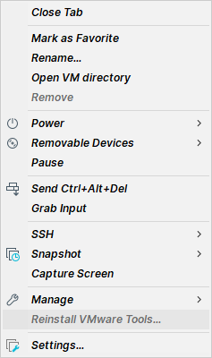

# Windows 10 + VMware Workstation Pro 16

## Build Procedure

### Prerequisites

1. Download *VMware Workstation Pro 16* from [the official website](https://www.vmware.com/products/workstation-pro/workstation-pro-evaluation.html). After downloading the program from the site, double-click the program to install *VMware Workstation Pro 16*.

2. Download *Vagrant* from [the official website](https://www.vagrantup.com/downloads). After downloading the program from the site, double-click the program to install *Vagrant*.

3. Download *Vagrant VMware Utility* from [the official website](https://www.vagrantup.com/vmware/downloads). After downloading the program from the site, double-click the program to install *Vagrant VMware Utility*.

4. Install *Vagrant VMware provider plugin* by executing the command:

   ```powershell
   vagrant plugin install vagrant-vmware-desktop
   ```

### Building and Deploying

After all the installation, follow the instructions [here](https://www.detectionlab.network/deployment/windowsvm/#instructions).

## Things to Notice

### Prerequisites

- Building the lab on a low-end machine is not recommended because manual configurations might be required under this condition due to the slow running speed of the machine. For example, when the *network visibility* option prompts, you may have to configure it manually. Also, when the login page appears, you may have to manually enter the password. Credentials can be found [here](https://www.detectionlab.network/introduction/infoandcreds/).

- Before executing the `prepare.ps1` script, ensure your machine's execution policy is correct. Refer to [the official documentation](https://docs.microsoft.com/en-us/powershell/module/microsoft.powershell.core/about/about_execution_policies?preserve-view=true&view=powershell-7.2&viewFallbackFrom=powershell-7.1). Alternatively, temporarily bypass the policy by adding the `-ep Bypass` flag to the command, e.g., `pwsh -ep Bypass .\prepare.ps1`.

- If you already have multiple virtual machine platforms installed on your machine, please examine the *network adapter settings* of your machine in order to avoid any collision. For example, you may want to check whether `192.168.56.1` is occupied or not because DetectionLab will utilize this address.

### Building and Deploying

- Outputting debug information is highly recommended. This can be done by adding the `--debug 2>&1 | Tee-Object -FilePath "PATH TO YOUR LOG FILE"` flag after each `vagrant` command. For example, `vagrant up --debug 2>&1 | Tee-Object -FilePath ".\vagrant_up.log"`. Refer to [the official documentation](https://www.vagrantup.com/docs/other/debugging).

- When building **dc**, Vagrant might complain about "Timed out while waiting for the machine to boot" as described [here](https://github.com/clong/DetectionLab/issues/827). If you encounter this error but observe your **dc** VM is indeed up and running, you might want to change `timeout` settings in `Vagrantfile` under `DetectionLab/Vagrant` directory. A working practice is to set `timeout` to `2400`.

- When building Windows VMs (i.e., **dc**, **wef**, **win10**), *VMware Tools* might not be installed correctly, causing the failure of enabling shared folder, as described [here](https://github.com/clong/DetectionLab/issues/720). Under this condition, you should manually install *VMware Tools* inside those VMs. You can right-click the corresponding VM in the left panel and then refer to the image below. After installation, execute the command `vagrant reload <VM name>`, e.g., `vagrant reload dc`.

  

- After finishing the build procedure, you may want to execute the `post_build_checks.ps1` script to validate the build result. You can use the modified version [here](./misc/post_build_checks.ps1) instead of the original version to detect errors better.

- Before executing the `post_build_checks.ps1` script, ensure your machine's execution policy is correct. Refer to [the official documentation](https://docs.microsoft.com/en-us/powershell/module/microsoft.powershell.core/about/about_execution_policies?preserve-view=true&view=powershell-7.2&viewFallbackFrom=powershell-7.1). Alternatively, temporarily bypass the policy by adding the `-ep Bypass` flag to the command, e.g., `pwsh -ep Bypass .\post_build_checks.ps1`.
