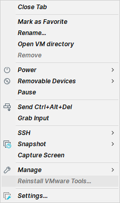

# TestLab Documentation

## DetectionLab Setup

This section introduces how to set up [DetectionLab](https://github.com/clong/DetectionLab) on your machine. Select the corresponding environment for your machine:

### Windows 10 + VMware Workstation Pro 16

#### Build Procedure

1. Download *VMware Workstation Pro 16* from [the official website](https://www.vmware.com/products/workstation-pro/workstation-pro-evaluation.html). After downloading the program from the site, double-click the program to install *VMware Workstation Pro 16*.
2. Download *Vagrant* from [the official website](https://www.vagrantup.com/downloads). After downloading the program from the site, double-click the program to install *Vagrant*.
3. Download *Vagrant VMware Utility* from [the official website](https://www.vagrantup.com/vmware/downloads). After downloading the program from the site, double-click the program to install *Vagrant VMware Utility*.
4. Install *Vagrant VMware provider plugin* by executing the command:

   `$ vagrant plugin install vagrant-vmware-desktop`

5. Follow the instructions [here](https://www.detectionlab.network/deployment/windowsvm/#instructions).

#### Things to Notice

- Building the lab on a low-end machine is not recommended because manual configurations might be required under this condition due to the slow running speed of the machine. For example, when the *network visibility* option prompts, you may have to configure it manually. Also, when the login page appears, you may have to manually enter the password. Credentials can be found [here](https://www.detectionlab.network/introduction/infoandcreds/).
- Before executing the `prepare.ps1` script, ensure your machine's execution policy is correct. Refer to [the official documentation](https://docs.microsoft.com/en-us/powershell/module/microsoft.powershell.core/about/about_execution_policies?preserve-view=true&view=powershell-7.2&viewFallbackFrom=powershell-7.1). Alternatively, temporarily bypass the policy by adding the `-ep Bypass` flag to the command, e.g., `pwsh -ep Bypass .\prepare.ps1`.
- If you already have multiple virtual machine platforms installed on your machine, please examine the *network adapter settings* of your machine in order to avoid any collision. For example, you may want to check whether `192.168.56.1` is occupied or not because DetectionLab will utilize this address.
- Outputting debug information is highly recommended. This can be done by adding the `--debug 2>&1 | Tee-Object -FilePath "PATH TO YOUR LOG FILE"` flag after each `vagrant` command. For example, `vagrant up --debug 2>&1 | Tee-Object -FilePath ".\vagrant_up.log"`. Refer to [the official documentation](https://www.vagrantup.com/docs/other/debugging).
- When building **dc**, Vagrant might complain about "Timed out while waiting for the machine to boot" as described [here](https://github.com/clong/DetectionLab/issues/827). If you encounter this error but observe your **dc** VM is indeed up and running, you might want to change `timeout` settings in `Vagrantfile` under `DetectionLab/Vagrant` directory. A working practice is to set `timeout` to `2400`.
- When building Windows VMs (i.e., **dc**, **wef**, **win10**), *VMware Tools* might not be installed correctly, causing the failure of enabling shared folder, as described [here](https://github.com/clong/DetectionLab/issues/720). You should manually install *VMware Tools* inside those VMs. You can right-click the corresponding VM in the left panel and then refer to the image below. After installation, execute the command `vagrant reload <VM name>`, e.g., `vagrant reload dc`.

  

- Before executing the `post_build_checks.ps1` script, ensure your machine's execution policy is correct. Refer to [the official documentation](https://docs.microsoft.com/en-us/powershell/module/microsoft.powershell.core/about/about_execution_policies?preserve-view=true&view=powershell-7.2&viewFallbackFrom=powershell-7.1). Alternatively, temporarily bypass the policy by adding the `-ep Bypass` flag to the command, e.g., `pwsh -ep Bypass .\post_build_checks.ps1`.

### Ubuntu 20.04 + VirtualBox 6.1.34

#### Build Procedure

#### Things to Notice

### ESXi (working)

#### ESXi installation

- register account, get a license key, and download the ESXi .ISOs
 <https://www.vmware.com/go/get-free-esxi>
- create a bootable USB using Rufus (<https://rufus.ie/>)
- install ESXi using bootable USB
- follow the instructions [here](https://clo.ng/blog/detectionlab-on-esxi)
- !!! 'No Network Adapter' issue during ESXi installation:
 using ESXi v6.7 would solve issue.

#### prereq

 <https://detectionlab.network/introduction/prerequisites/>
 <https://detectionlab.network/deployment/esxi/>

- ESXi 6.x
- Vagrant 2.2.9+
- Packer v1.7.0+ and in PATH
- Terraform v0.13+
- OVFTool in 'PATH'
 <https://code.vmware.com/web/tool/4.4.0/ovf>
- Ansible and pywinrm in 'PATH'
 run: "pip3 install ansible pywinrm --user"
 (this might require step installing python & pip3)
- sshpass
 run: "setup-x86_64.exe -q -s <http://cygwin.mirror.constant.com> -P sshpass" where 'setup-x86_64.exe' locate
 (this requires installing cygwin from <https://cygwin.com/install.html>)
 (installation step inspired from: <https://stackoverflow.com/questions/37243087/how-to-install-sshpass-on-windows-through-cygwin>)

- Git clone DetectionLab to local device:
 run: "git clone <https://github.com/clong/DetectionLab.git>"

- On ESXi host:
 Enable SSH
 Enable "Guest IP Hack"
 Open VNC ports on the firewall
  Openning VNC ports allows 'windows_10_esxi' and 'ubuntu2004_esxi' accessibility to ESXi host
 Instructions for above:
  <https://nickcharlton.net/posts/using-packer-esxi-6.html>
  to edit files on ESXi host, use 'vi' comment (<https://kb.vmware.com/s/article/1020302>)

#### steps

##### Edit configuration files

- in 'DetectionLab/ESXi/Packer/variables.json'
 match variable to ESXi host environment
 usually set 'esxi_network_with_dhcp_and_internet' to "VM Network"
- for ESXi 6.x host
 remove
  “vnc_over_websocket”: true,
  “insecure_connection”: true,
 from 'builders' array under
  DetectionLab/ESXi/Packer/windows_10_esxi.json
  DetectionLab/ESXi/Packer/windows_2016_esxi.json
  DetectionLab/ESXi/Packer/ubuntu2004_esxi.json

#####

From DetectionLab/ESXi/Packer
 PACKER_CACHE_DIR=../../Packer/packer_cache packer build -var-file variables.json windows_10_esxi.json
 PACKER_CACHE_DIR=../../Packer/packer_cache packer build -var-file variables.json windows_2016_esxi.json
 PACKER_CACHE_DIR=../../Packer/packer_cache packer build -var-file variables.json ubuntu2004_esxi.json
From DetectionLab/ESXi
 create terraform.tfvars to override - <https://www.terraform.io/language/values/variables#variable-definitions-tfvars-files>

C:\ewalker\install pack
C:\ewalker\install pack\setup-x86_64.exe -q -s <http://cygwin.mirror.constant.com> -P sshpass

{
    "esxi_host": "192.168.30.181",
    "esxi_datastore": "datastore1",
    "esxi_username": "root",
    "esxi_password": "eWalker123",
    "esxi_network_with_dhcp_and_internet": "VM Network"
}

cd d:\work\ewalker\DetectionLab\ESXi\Packer

////////

## BlueTeam.Lab Setup

This section introduces how to set up [BlueTeam.Lab](https://github.com/op7ic/BlueTeam.Lab) on your machine. Select the corresponding environment for your machine:
